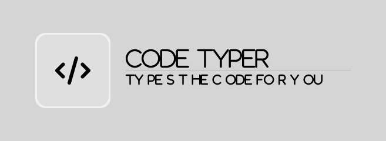

<p align="center">
  
</p>

# Code Typer

Утилита для лайв-демо: вставляешь код, жмёшь F6 — и она печатает его за тебя посимвольно, как будто ты набираешь вручную. Удобно для стримов, записи видео, презентаций.

## Зачем это нужно

Бывает, показываешь код на демо или стриме — и не хочется копипастить, выглядит некрасиво. А набирать руками долго и с опечатками. Code Typer решает эту проблему: ты просто нажимаешь любую клавишу, а программа вводит следующий символ из загруженного кода. Выглядит натурально.

## Как работает

- Перехватывает нажатия клавиш через Win32 keyboard hook
- Подменяет ввод на символы из загруженного кода
- Отличает реальные нажатия от своих через флаг `LLKHF_INJECTED`
- Скорость задержки между символами можно настроить слайдером

## Установка

```bash
pip install -r requirements.txt
```

Нужен Python 3.8+ и Windows (хук клавиатуры работает только на винде).

## Запуск

```bash
python app.py
```

## Как пользоваться

1. Вставляешь или пишешь код в текстовое поле
2. Жмёшь **F6** — программа начинает работать
3. Переключаешься в любой редактор и нажимаешь клавиши — Code Typer сам подставляет нужные символы
4. **F6** ещё раз — остановка
5. Слайдером можно регулировать задержку между символами

## Сборка в exe

```bash
pyinstaller CodeTyper.spec
```

Готовый файл будет в папке `dist/`.

## Стек

- **PyQt5** — интерфейс
- **ctypes** — Win32 API для перехвата клавиатуры
- Без внешних зависимостей кроме PyQt5

## Лицензия

MIT
